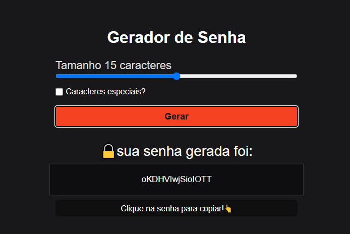

# 🔒  Gerador de Senha
Um gerador de senhas aléatorias.

## 🔥  Projeto
O objetivo principal do projeto foi aplicar os conhecimentos em javaScript para a criação de um aplicativo que gerasse senhas de maneira aleatória, implementando também, a opção de conter caracteres especiais ou não na senha final.

## 👨‍💻  Tecnologias

## 💻  Site

**<a href="https://nosferavic.github.io/geradorSenha/">Gerador de Senha</a>**
